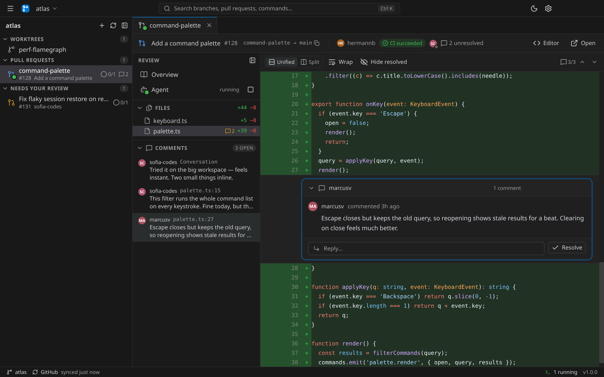
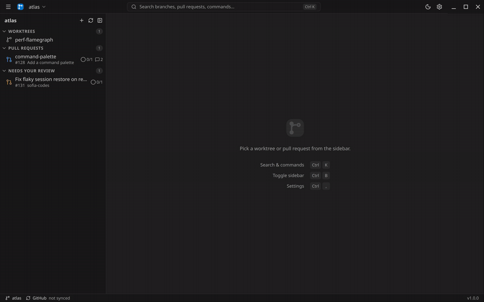
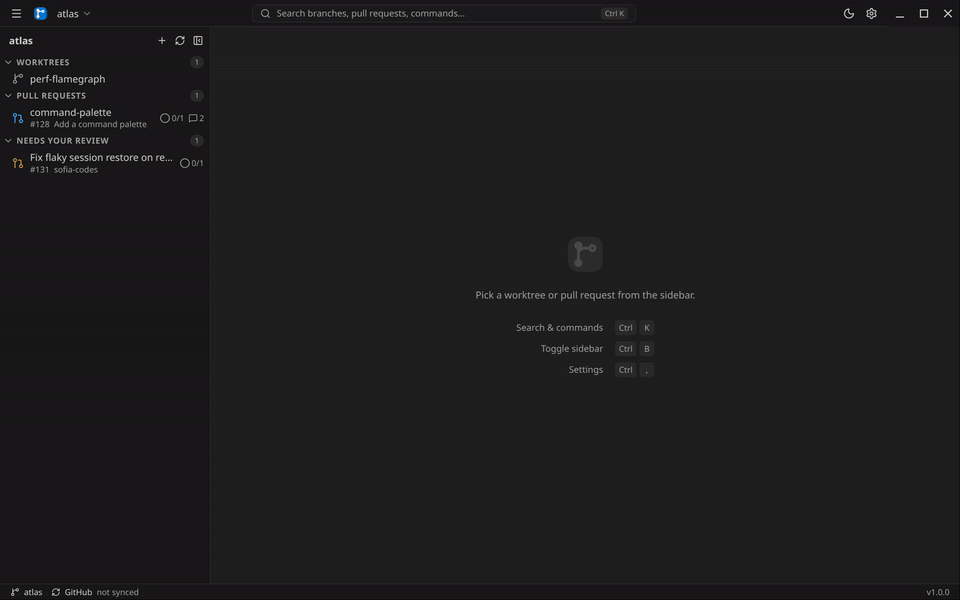
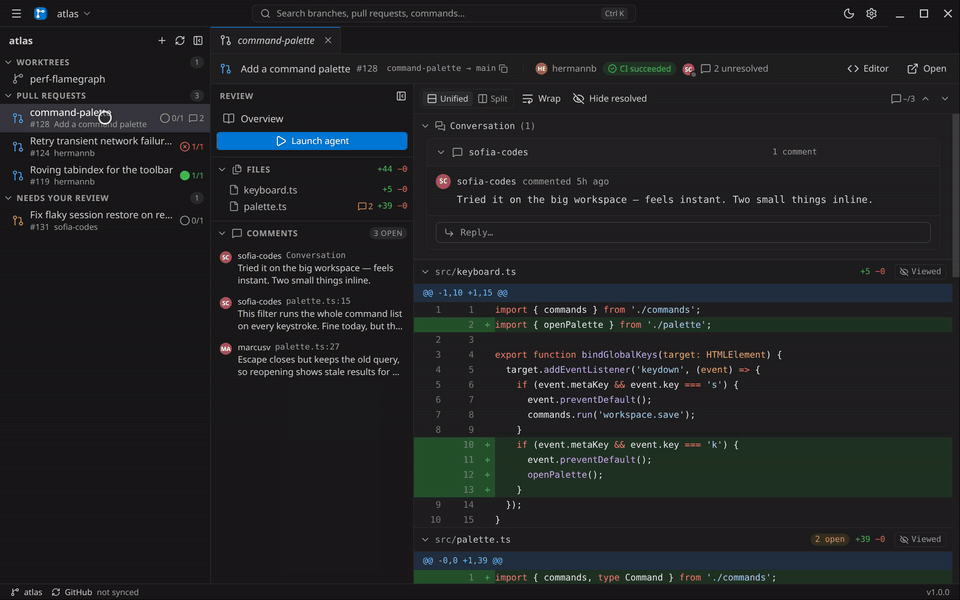
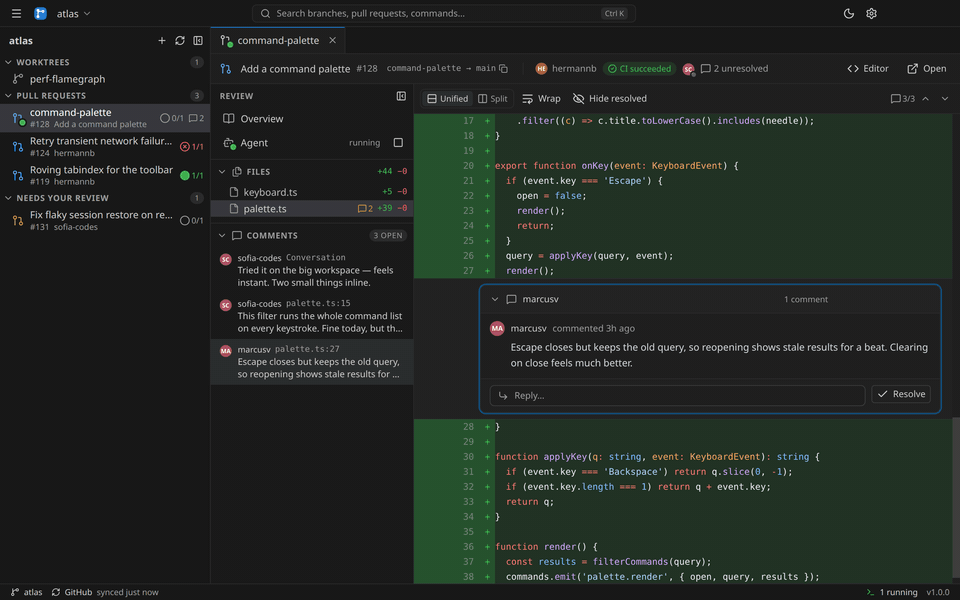
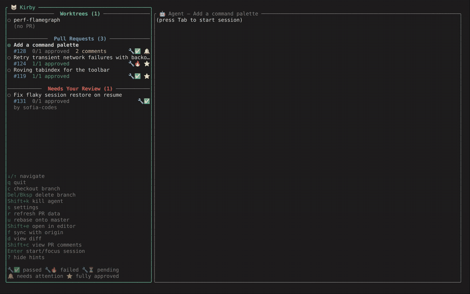

# 😸 Kirby (working title, name of my cat)

A desktop app and a terminal UI for running AI coding agents across git worktrees, with pull request status and code review built in.

Kirby started as a way to solve my own workflow. I spend my working hours in a large monorepo, usually with several features and reviews in flight at once, and I wanted one place to manage the worktrees and agent sessions that go with them and to help me automate reviewing pull requests while remaining familiar with the source code.

<picture>
  <source media="(prefers-color-scheme: dark)" srcset="docs/media/hero.png">
  <source media="(prefers-color-scheme: light)" srcset="docs/media/hero-light.png">
  
</picture>

## Installation

Two front ends over the same core. Install both:

```sh
npm install -g @hermannbjorgvin/kirby-desktop   # desktop app
npm install -g @hermannbjorgvin/kirby           # terminal UI, and the `kirby` cli utils
```

Then run `kirby-desktop` or `kirby` from any project directory.

Review agents record their comments by running `kirby util add-comment`, so agent-drafted reviews need `kirby` on your `PATH` even if you only open the desktop app. Everything else works without it.

## Features

### A worktree and an agent per branch



- **Worktree-based sessions** - every branch gets its own git worktree and a long-lived agent session, so several features can be in flight without stashing or disturbing your main checkout.
- **PR status next to every worktree** - open, draft or merged, CI result, review status and conflict count, inline in the sidebar. One circle carries both axes: red when a build failed or someone rejected, green and filled only when CI passed _and_ everyone approved.
- **GitHub and Azure DevOps** - both supported today, though not equally well exercised — see [Version control providers](#version-control-providers).
- **Branch sync** - detects merged branches, counts conflicts against the base, auto-deletes merged worktrees, and rebases onto the base with one key.

### Agent-drafted reviews



Point an agent at a pull request and have it review the diff. It leaves inline draft comments anchored to the lines they're about, and you walk through them in severity order — edit, discard, skip, or post. You stay the author of record; the agent just does the first pass.

### Plan comments into a cart



The other direction: on a PR you're resolving, add the comments you want to address to a plan, like a shopping cart. Annotate any with a note on how you want it handled, then check out — the whole thing goes to an agent as one task, and you can read the exact prompt first.

### Review in place

Browse files and diffs, read threads, reply, resolve and reopen without leaving Kirby. The desktop adds whole-file diffs with folding, split and unified views, and word-level highlighting.

### Customizable and agent agnostic

- **Pick your agent** - Claude, Codex, Gemini, Copilot, or OpenCode, configurable per project.
- **Customizable keybindings** - Normie and Vim presets out of the box, remappable from the Controls panel.
- **Light and dark** - the desktop follows your system theme, or pin one.



> Kirby is early-stage software. It works well enough that we rely on it every day, but expect rough edges and breaking changes.

## The terminal UI

Most of the work goes into the desktop app now, but `kirby` is the whole thing without a window — same core, same config, same worktrees, shared with the desktop.



Sidebar status, diffs with threads inline, `a`/`A` to queue a comment with a note, `enter` to send the plan to an agent. Split, word-level and folded diffs are desktop-only.

## Prerequisites

- git
- An agent CLI on your `PATH` — `claude`, `codex`, `copilot`, `gemini` or `opencode`
- `kirby` on your `PATH` for agent-drafted reviews, including when you use the desktop app
- For GitHub: the `gh` CLI, authenticated
- For Azure DevOps: a personal access token with repo and pull request access
- `tmux` (optional) — agent sessions then survive quitting and are reattached next launch
- On Linux, the desktop app compiles `node-pty` during install: `sudo apt install build-essential python3`

## Version control providers

| Provider                              | Auth                   | Tested                                       |
| ------------------------------------- | ---------------------- | -------------------------------------------- |
| GitHub                                | authenticated `gh` CLI | unit, offline e2e, live integration          |
| Azure DevOps                          | personal access token  | unit + recorded API responses; no live tests |
| GitLab, Bitbucket, Gitea, self-hosted | not supported          | —                                            |

An Azure DevOps regression won't be caught by CI, so bug reports help. Providers sit behind one interface (`libs/vcs/`) — more can be added, PRs welcome.

## Configuration

On first run in a new project, an onboarding wizard walks you through connecting your VCS provider. After that, open settings (`s` in the TUI, ⌘, / Ctrl+, on the desktop) to change the provider, AI agent, sync intervals, and auto-behaviors (auto-delete merged branches, auto-rebase). Auto-detect fills in project settings from the git remote.

Keybindings are remappable. Kirby ships with a Normie preset and a Vim preset; open the Controls panel to switch presets or rebind individual actions.

Everything lives in `~/.kirby/`.
